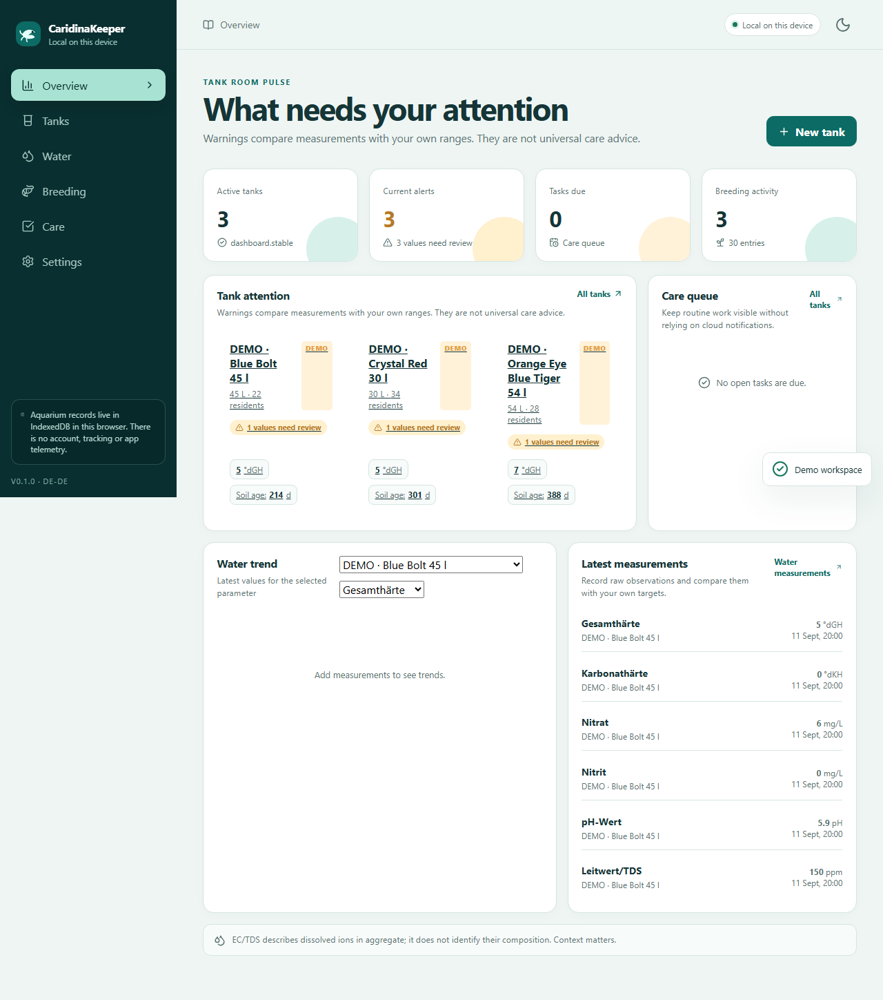
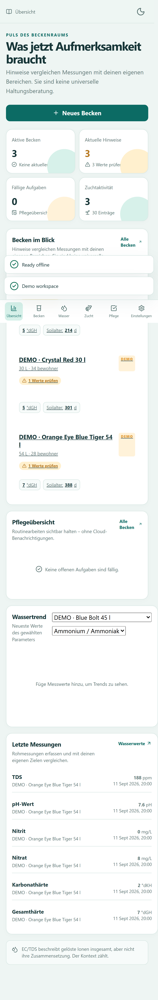
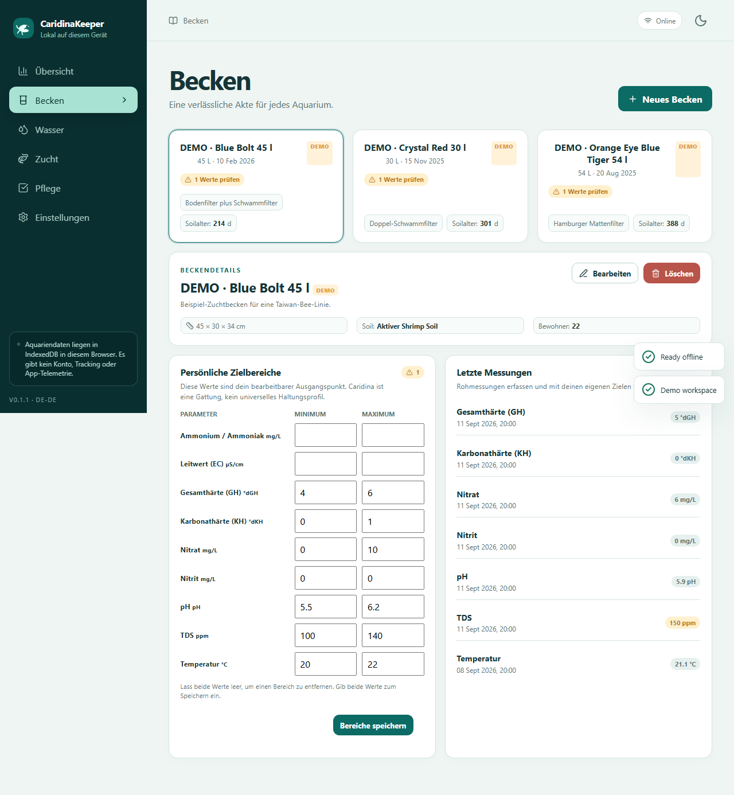

# CaridinaKeeper

CaridinaKeeper is a privacy-first, offline-first progressive web app for aquarium records and Caridina breeding journals. It stores records in the browser's IndexedDB, works without an account or backend, and exports a versioned JSON backup plus a spreadsheet-safe CSV of water readings.

Live preview: [deniss6886.github.io/CaridinaKeeper](https://deniss6886.github.io/CaridinaKeeper/) · Source: [GitHub](https://github.com/Deniss6886/CaridinaKeeper)

> **Status:** 0.1.0 preview. The data model and workflows are usable, but migrations, browser support, and the Home Assistant connector remain under active development. Do not treat a target warning as a diagnosis or as permission to actuate equipment.

## What is included

- tanks, inhabitants, editable target ranges, measurements with method and uncertainty;
- maintenance events, reminders, breeding lines, events, crosses, and outcomes;
- local-first IndexedDB storage with validated, atomic JSON restore;
- English and German UI, responsive layout, keyboard-friendly dialogs, reduced-motion support, PWA install/update prompt;
- demo data that is visibly labelled and replaceable;
- no cloud account, telemetry, advertising, remote fonts, or automatic dosing/heating/cooling.

## Quick start

Requires Node.js 24 LTS and npm 11.

```bash
npm ci
npm run dev
```

Then open the local URL printed by Vite. Before deleting browser data or changing the hosting origin, use **Settings → Export JSON**. The backup is the portable source of truth.

Useful checks:

```bash
npm run check       # format, lint, typecheck, unit tests, production build
npm run test:e2e    # build, Chromium + mobile smoke and accessibility checks
npm run security:audit
```

## Screenshots







## Scientific and safety boundaries

Caridina is a diverse genus, not a single husbandry profile. Ranges are editable keeper targets, not universal claims. EC/TDS is recorded with its unit and provenance; a conductivity value does not identify the ions present. The app shows association and missing context rather than diagnosing disease, inferring genetics, or commanding equipment. See [the research notes](docs/RESEARCH.md), [privacy model](docs/PRIVACY.md), and [security review](docs/SECURITY_REVIEW.md).

## Contributing and support

Read [CONTRIBUTING.md](CONTRIBUTING.md), [the development guide](docs/DEVELOPMENT.md), and [the code of conduct](CODE_OF_CONDUCT.md). Security-sensitive reports belong in the private channel described in [SECURITY.md](SECURITY.md), not in a public issue.

## License

MIT. See [LICENSE](LICENSE).
